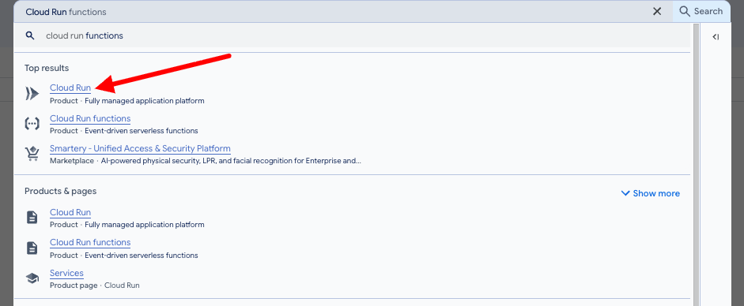
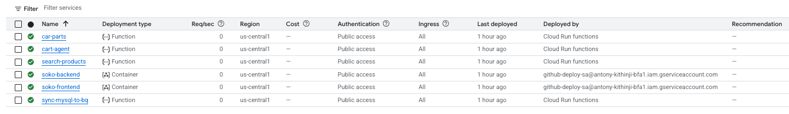
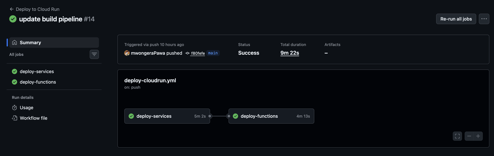
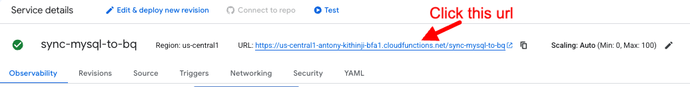
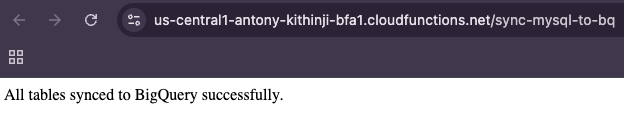

# Access the Application

Once the GitHub Actions pipeline completes, your full application stack is live on Google Cloud. This section walks you through verifying the deployed services, running the BigQuery sync, and accessing the frontend URL.

---

## Expected Results

After a successful pipeline run you should have:

- ☁️ **6 running Cloud Run services**
    - `soko-frontend` — the Next.js frontend
    - `soko-backend` — the NestJS backend
    - 4 pre-deployed Cloud Functions (checkout and supporting services)
- 💾 A **deployed and seeded Cloud SQL instance** (`cloud-mastery-db-v8`)
- 📊 A **BigQuery dataset** ready to be populated from Cloud SQL

---

## Step 1: Verify Your Cloud Run Services

1. In the GCP Console, search for **Cloud Run**.

    

2. Click on **Services** to see all deployed services.

    

3. Confirm you see 6 services, all showing a green status indicator.

    

---

## Step 2: Sync Cloud SQL Data to BigQuery

You need to manually trigger the `sync-mysql-to-bq` Cloud Function once. This populates your BigQuery dataset from Cloud SQL, making the data available for analytics and AI/ML use cases in the next lab.

1. In the Cloud Run services list, click on **`sync-mysql-to-bq`**.

2. Use the trigger URL or click **Test** to invoke the function.

    

3. Wait for the function to complete. You will see a success message once the sync finishes.

    

---

## Step 3: Access the Frontend Application

1. In the Cloud Run services list, click on the **`soko-frontend`** service.

2. At the top of the service details page you will find the application's public **URL**.

3. Click the URL to open your fully deployed application in a new browser tab.

!!! success "Congratulations — you're done!"
    Your application is live. Throughout this lab you have:

    - Set up a Cloud SQL MySQL instance and seeded it with sample data
    - Configured Workload Identity Federation for keyless, secure GCP authentication from GitHub
    - Established a GitHub Actions CI/CD pipeline
    - Deployed a NestJS backend and Next.js frontend to Cloud Run
    - Synced data from Cloud SQL to BigQuery for the analytics lab

---

  

    <a href="../setup-frontend-pipeline/" class="btn-secondary">← Previous: Trigger the Pipeline</a>
  

  

    <strong>Access the Application</strong>
  

  

    <a href="/data-analytics/data-analytics-lab/" class="btn-primary">Next: Analytics Lab →</a>
  

