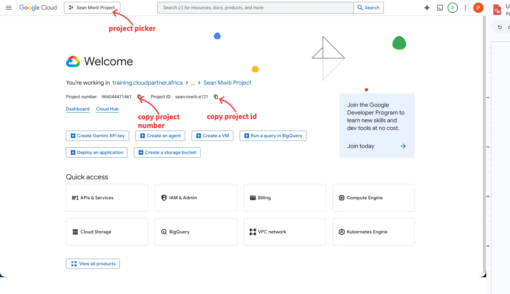
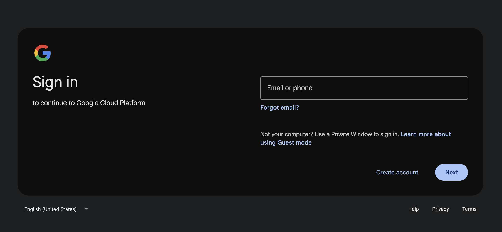
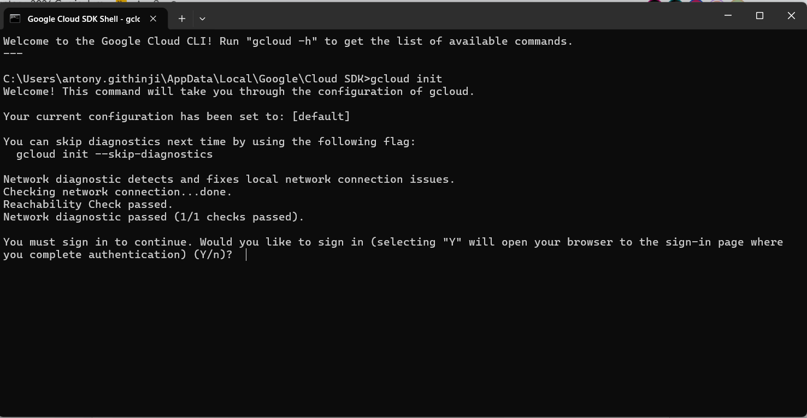
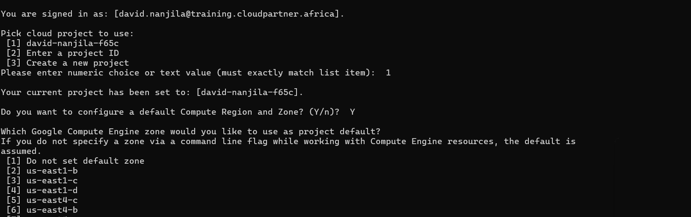
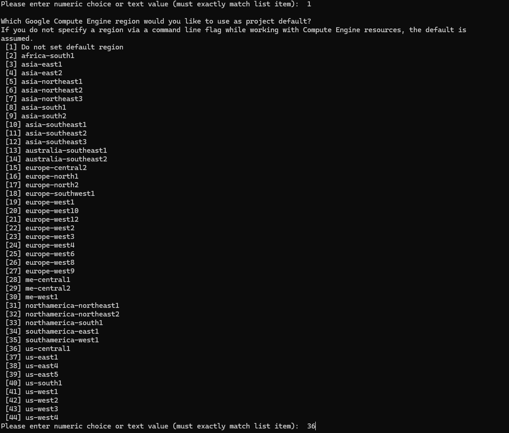

# Cloud Mastery: Pawa-ring AI-Powered Apps

## Session Overview

This session focuses on setting up the core, secure infrastructure for an AI-powered e-commerce application. You will connect a NestJS backend to a Cloud SQL (MySQL) database, establish robust CI/CD pipelines using Workload Identity Federation and GitHub Actions for deployment to Cloud Run, and set up a foundation for data replication to BigQuery for advanced AI/ML analytics with Vertex AI.

### What You'll Learn

- Connect a NestJS backend to a Cloud SQL (MySQL) database
- Build the core AI API routes
- Establish separate and secure CI/CD pipelines using GitHub Actions and Workload Identity Federation
- Deploy containerised applications to Cloud Run
- Replicate data to BigQuery for analytics and AI/ML

### Core Technologies

| Category | Technology |
|---|---|
| IDE | VS Code or Antigravity IDE |
| Backend | NestJS (Node.js Framework) |
| Frontend | Next.js |
| Database | Cloud SQL for MySQL |
| Data Warehouse | BigQuery |
| AI/ML | Vertex AI — Gemini Models, Agent Builder, BigQuery ML |
| Deployment | Cloud Run with GitHub Actions & Workload Identity Federation |

---

## Resources Already Allocated for You

Your Google Workspace email and password have been shared with you at the email address you registered with for this event. These credentials give you access to a dedicated GCP project named after you.

---

## Step 1: Login to GCP

1. Open the Google Cloud Console: [https://console.cloud.google.com](https://console.cloud.google.com)

2. Sign in with the designated email shared with you. On successful login you will see a project with your name on it.

    

3. Confirm you can access your Google Cloud project. The project will be named according to your name — for example, `eddie-ngugi-3a56`.

---

## Step 2: Login to GitHub

1. Navigate to [https://github.com](https://github.com) and select the **Sign in with Google** option if your account is linked to your Google account.

2. Select your work or personal email (e.g., `eddie@training.cloudpartner.africa`).

3. Click **Continue** to authorise GitHub to access your basic profile information.

    

---

## Step 3: Set Up the gcloud CLI

The gcloud CLI lets you run GCP commands from your local machine. If you haven't installed it yet, follow the official guide:
[https://docs.cloud.google.com/sdk/docs/install-sdk](https://docs.cloud.google.com/sdk/docs/install-sdk)

### 3.1 — Run gcloud init

Once installed, run the following command in your terminal or command prompt:

```shell
gcloud init
```

A browser window will open. Sign in with the Google account you were given and click **Allow**.



### 3.2 — Set the Default Zone

When prompted to set a default zone, **enter `1`** to select "Do not set default zone".



### 3.3 — Set the Default Region

When prompted for a default region, **enter `36`** to select `us-central1`.



### Essential gcloud Commands

Once logged in, these are the core commands you will use throughout the lab:

| Command | What it does |
|---|---|
| `gcloud auth login` | Forces a new browser login — useful if your session expires or you need to switch accounts |
| `gcloud projects list` | Shows all cloud projects attached to your account |
| `gcloud config set project [PROJECT_ID]` | Switches your active terminal session to a different project |
| `gcloud info` | Displays your current environment details, active account, and current project |

!!! tip
    Add `--help` to the end of any command (e.g., `gcloud projects --help`) to get the built-in manual for that command.

---

## What's Next

You are now logged in to GCP and GitHub with your gcloud CLI initialised. In the next section you will create and configure the Cloud SQL database.

---

<div class="page-nav">
  <div class="nav-item">
    <a href="../../introduction/" class="btn-secondary">← Previous: Introduction</a>
  </div>
  <div class="nav-item">
    <span><strong>DevOps Lab</strong></span>
  </div>
  <div class="nav-item">
    <a href="../setup-cloud-sql" class="btn-primary">Next: Setup Cloud SQL →</a>
  </div>
</div>
