# Setup Cloud SQL

In this section you will create a Cloud SQL (MySQL) database instance, add a user, seed it with sample data from the repository's SQL dump file, and copy the connection details you will need later.

---

## Step 1: Enable the Cloud SQL API

1. Navigate to Cloud SQL: [https://console.cloud.google.com/sql/instances](https://console.cloud.google.com/sql/instances)

2. If prompted, click **Enable** to activate the Cloud SQL Admin API.

    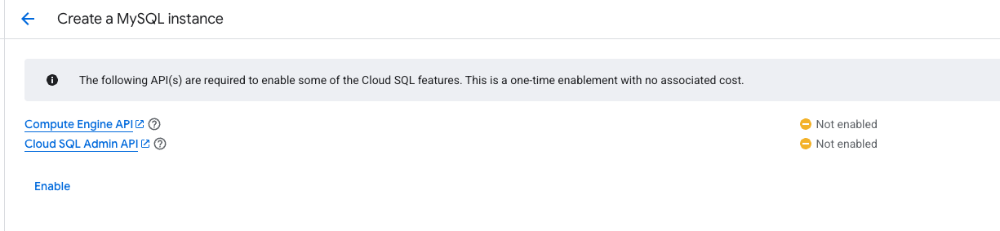

---

## Step 2: Create the Instance

1. Click **Create instance**.

    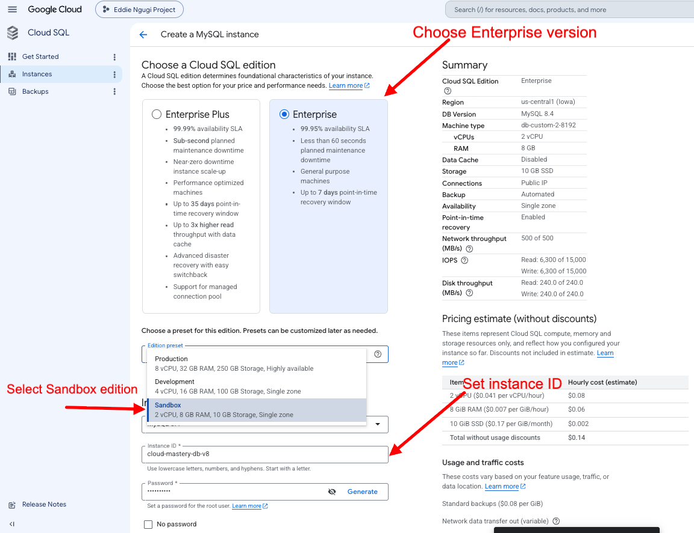

2. Choose **MySQL** as the database engine.

3. If prompted to enable the Compute Engine API, click **Enable**.

    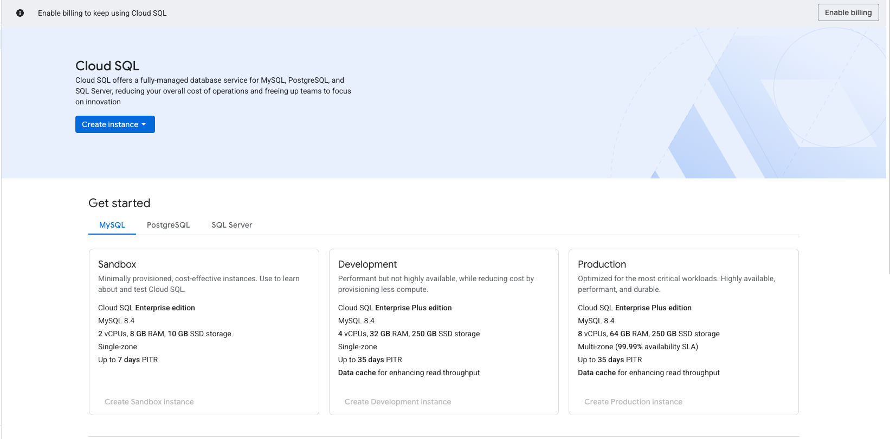

4. Configure the instance with these settings:

    | Setting | Value |
    |---|---|
    | Edition | Enterprise |
    | Edition preset | Sandbox |
    | Database version | MySQL 8.4 |
    | Instance ID | `cloud-mastery-db-v8` |
    | Root password | Set a password and note it down |
    | Region | `us-central1` |
    | Zonal availability | Single zone |

5. Click **Create instance** to begin provisioning (this takes a few minutes).

6. Once complete you will see your running instance in the list.

    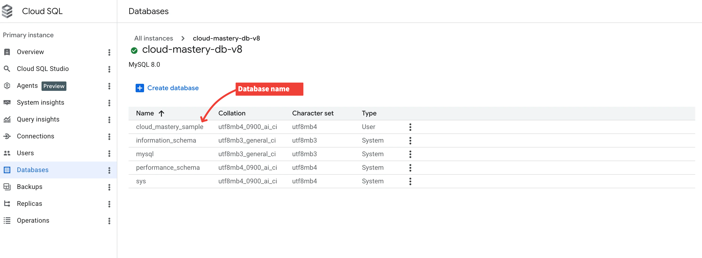

---

## Step 3: Add a Database User

1. In the left sidebar of your Cloud SQL instance, click **Users**, then click **Add user account**.

2. In the side panel that opens, select **Built-in Authentication** and fill in:

    | Field | Value |
    |---|---|
    | Username | `Cloud_Mastery` |
    | Password | `Mastery_Cloud1` |

3. Click **Add** to save.

---

## Step 4: Create a Cloud Storage Bucket for the SQL Dump

You will upload the SQL seed file to Cloud Storage so that Cloud SQL can import it.

1. In your instance's overview page click **Import data**, then click **Browse** under Select source file.

2. In the file browser, click the **Create bucket** icon in the top-right corner.

    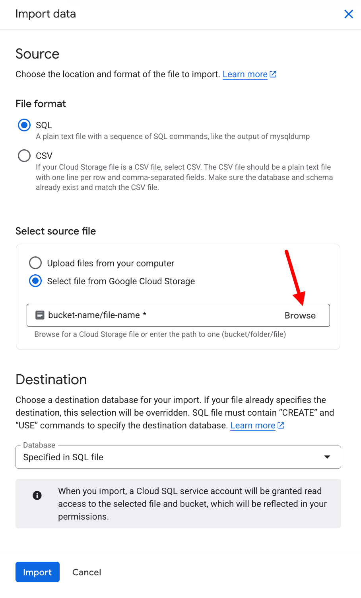

3. Give the bucket a unique name (e.g., `cloud-mastery-pawait`) and select region `us-central1`.

    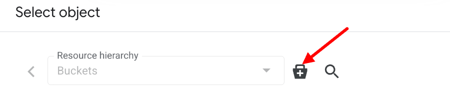

4. Before finalising, **uncheck** "Enforce public access prevention on this bucket" so Cloud SQL can read from it.

5. Click **Create**.

    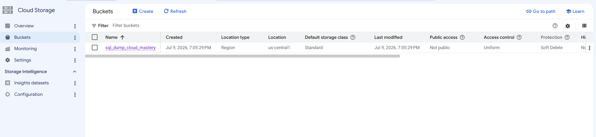

---

## Step 5: Upload the SQL Dump File

1. Navigate to **Cloud Storage → Buckets** and open the bucket you just created.

    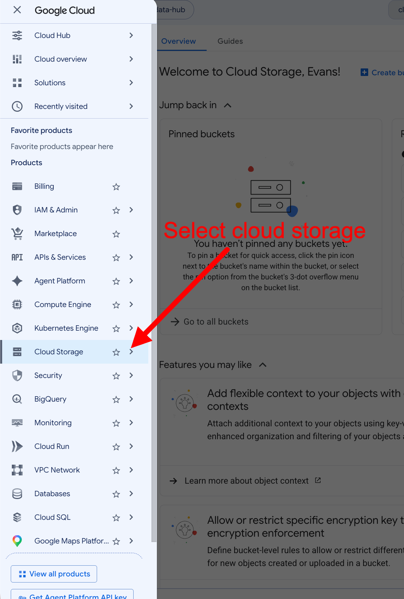

2. Click **Upload → Choose files** and locate the SQL dump from the cloned repository:

    ```
    cloud-mastery-ecommerce-2026/backend/prisma/sql-dump.sql
    ```

    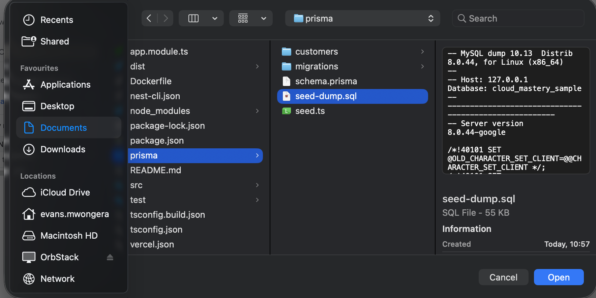

3. Select the file and confirm the upload. You will see `sql-dump.sql` appear in the bucket.

    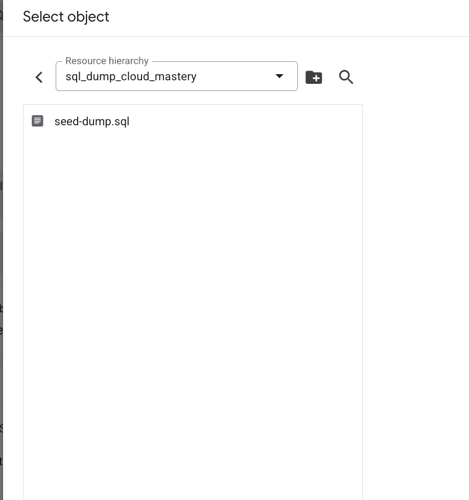

---

## Step 6: Import the SQL Dump into Cloud SQL

1. Go back to your Cloud SQL instance and click **Import data**.

2. Under **Source**, set the file type to **SQL**, click **Browse**, and select the `sql-dump.sql` file from your bucket.

3. Under **Destination**, expand the **Database** dropdown and select `cloud_mastery_sample`.

4. Click **Import** to start. You will be returned to the instance overview while the import runs.

---

## Step 7: Verify the Database

Once the import completes you can confirm the tables were created using Cloud SQL Studio.

1. In your instance details, click **Cloud SQL Studio**.

    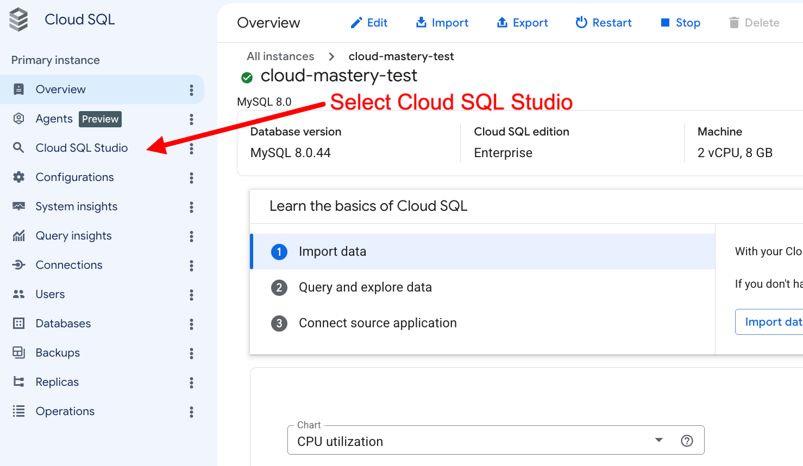

2. Select the `cloud_mastery_sample` database, enter your username (`Cloud_Mastery`) and password (`Mastery_Cloud1`), and click **Authenticate**.

    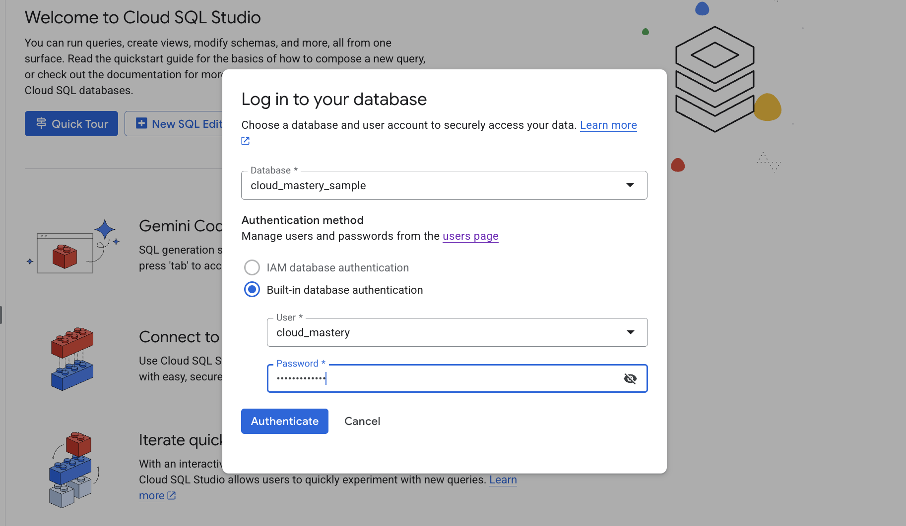

3. You should see the imported tables in the schema panel.

    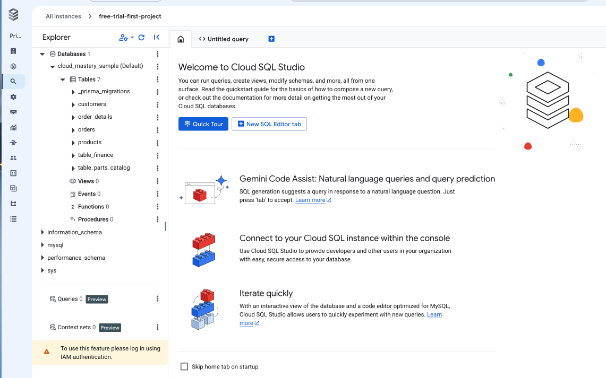

---

## Step 8: Copy the Connection Details

You will need these four values when configuring GitHub secrets in a later step.

1. In your instance's **Overview** page, scroll down to **Connect to this instance** and copy the **Connection name**:

    ```
    [PROJECT_ID]:us-central1:cloud-mastery-db-v8
    ```

    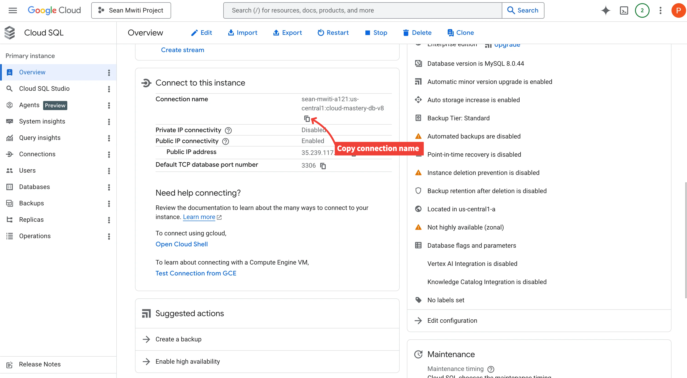

2. Under the **Databases** tab, confirm the database name is `cloud_mastery_sample`.

3. Keep a record of all four required parameters:

```shell
DB_NAME = cloud_mastery_sample
DB_PASS = Mastery_Cloud1
DB_USER = Cloud_Mastery
CLOUDSQL_INSTANCE_CONNECTION_NAME = [PROJECT_ID]:us-central1:cloud-mastery-db-v8
```

---

## What's Next

Database setup is complete. In the next section you will fork and clone the application repository.

---

<div class="page-nav">
  <div class="nav-item">
    <a href="../devops-lab/" class="btn-secondary">← Previous: DevOps Lab</a>
  </div>
  <div class="nav-item">
    <span><strong>Setup Cloud SQL</strong></span>
  </div>
  <div class="nav-item">
    <a href="../setup-github" class="btn-primary">Next: Setup GitHub →</a>
  </div>
</div>
