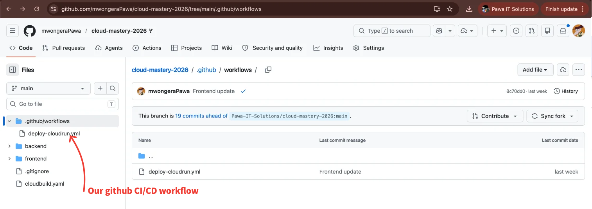

# Trigger the Deployment Pipeline

With your GitHub secrets configured, the CI/CD pipeline is ready. You will trigger it by pushing a small change to the repository's `README.md` file.

---

## How the Pipeline Works

The repository contains a pre-configured GitHub Actions workflow (`.github/workflows/`). The pipeline runs in two stages:

1. Deploy the **backend and frontend applications** to Cloud Run
2. Deploy the **four Cloud Functions** (checkout and supporting services)

Every push to the `main` branch automatically triggers this workflow using the secrets you set up.



---

## Step 1: Make a Change to README.md

1. Open the `README.md` file at the root of your `cloud-mastery-ecommerce-2026` directory in your IDE.

2. Add any small change — for example, a new line of text. The content of the change does not matter.

3. Save the file.

---

## Step 2: Commit and Push

Run the following commands in your terminal from inside the project directory:

```shell
# Make sure you are in the right directory
cd cloud-mastery-ecommerce-2026

# Stage all changes
git add .

# Commit with a message
git commit -m "Trigger deployment pipeline"

# Push to the main branch to trigger the workflow
git push origin main
```

!!! note
    If your default branch is named `master` instead of `main`, replace `main` with `master` in the push command.

!!! tip
    The pipeline deploys the backend first, then the frontend, then the Cloud Functions. Go to the **Actions** tab in your GitHub repository to watch the live logs. Total run time is typically 7–12 minutes.

---

## What's Next

Once the pipeline completes successfully, all services will be live on Cloud Run. In the next section you will verify the deployed services and access the running application.

---

<div class="page-nav">
  <div class="nav-item">
    <a href="../setup-backend-pipeline/" class="btn-secondary">← Previous: CI/CD Pipeline Setup</a>
  </div>
  <div class="nav-item">
    <span><strong>Trigger the Pipeline</strong></span>
  </div>
  <div class="nav-item">
    <a href="../accessing-the-application" class="btn-primary">Next: Access the Application →</a>
  </div>
</div>
