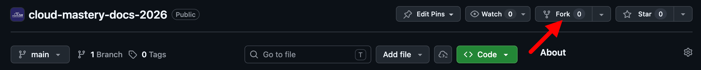
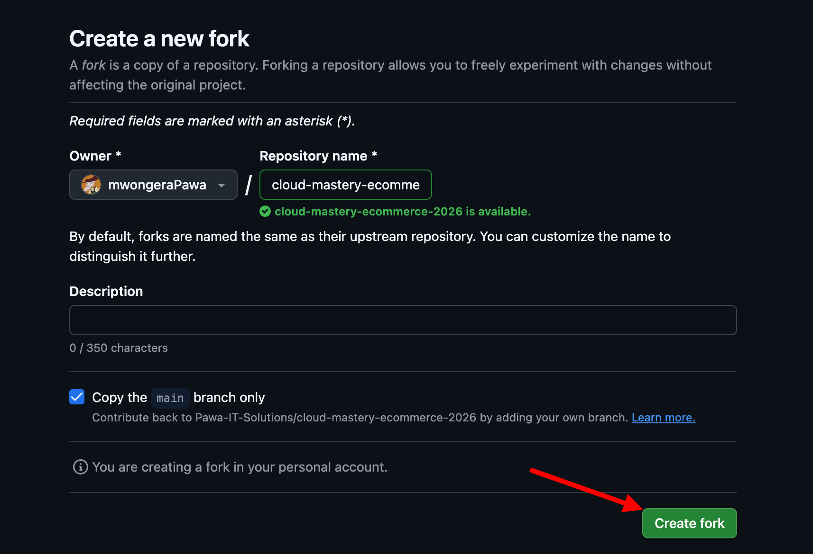
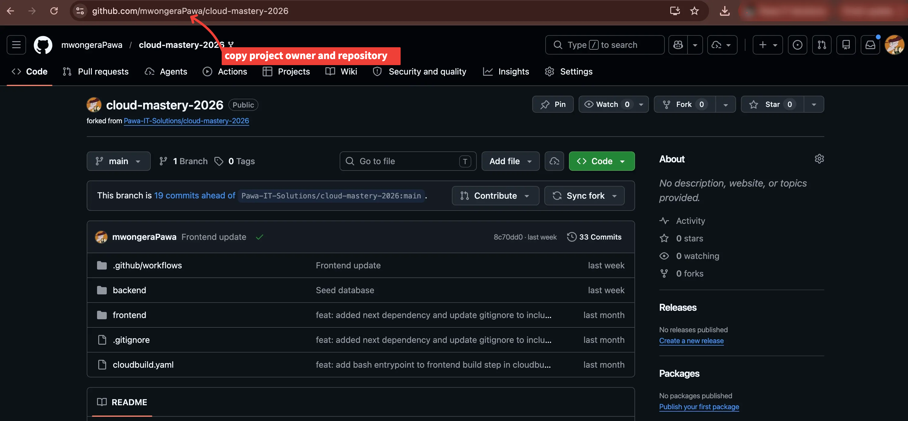
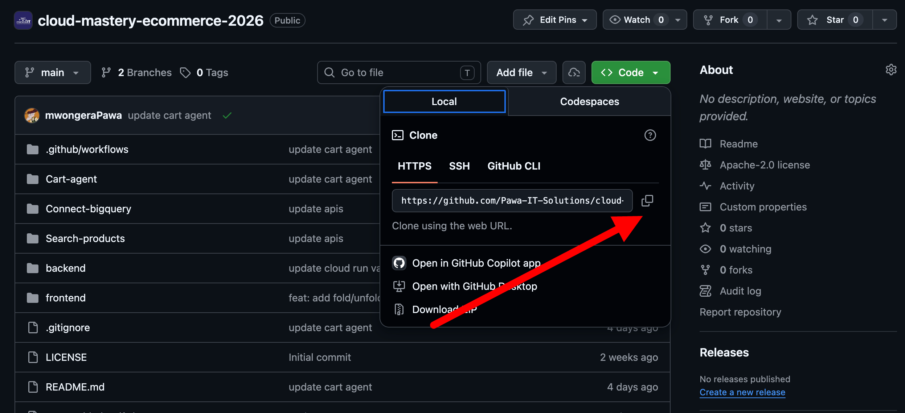
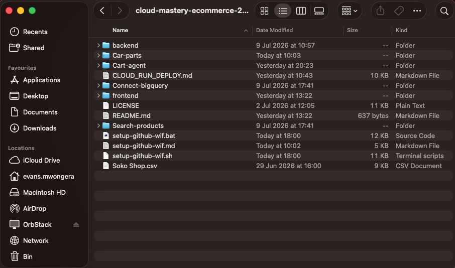

# Setup GitHub — Fork & Clone

In this section you will fork the Cloud Mastery 2026 repository to your GitHub account, clone it to your local machine, and open it in your IDE.

---

## Step 1: Fork the Repository

Forking creates a personal copy of the project under your own GitHub account. This lets you make changes without affecting the original codebase. The repo contains both the backend and frontend applications you will be deploying.

1. Navigate to the source repository:
   [https://github.com/Pawa-IT-Solutions/cloud-mastery-ecommerce-2026](https://github.com/Pawa-IT-Solutions/cloud-mastery-ecommerce-2026)

2. Locate the **Fork** button at the top-right of the page (next to the Star button). Click the dropdown and select **Create a new fork**.

    

3. On the **Create a new fork** page configure the following:

    | Field | Value |
    |---|---|
    | Owner | Your personal GitHub username (e.g., `eddie582`) |
    | Repository Name | `cloud-mastery-ecommerce-2026` |
    | Copy the main branch only | ✅ Keep checked |

4. Click the green **Create fork** button.

    

    After a moment you will be redirected to your own copy. The top-left should now read `your-username/cloud-mastery-ecommerce-2026`.

---

## Step 2: Clone the Repository

Now download the forked repository to your local machine.

1. On your forked repository page, click the green **<> Code** button and copy the **HTTPS** or **SSH** URL.

    

2. Open your terminal or command prompt and run the following command. Replace the URL with the one you copied from your fork:

    ```shell
    git clone https://github.com/[YOUR_USERNAME]/cloud-mastery-ecommerce-2026
    ```

    

3. Once the clone finishes, navigate into the project directory:

    ```shell
    cd cloud-mastery-ecommerce-2026
    ```

    

---

## Step 3: Open the Project in Your IDE

Open the `cloud-mastery-ecommerce-2026` folder in your preferred IDE — VS Code or Antigravity IDE.

=== "VS Code"

    ```shell
    code cloud-mastery-ecommerce-2026
    ```

=== "Antigravity IDE"

    Open the Antigravity IDE, then use **File → Open Folder** and select the `cloud-mastery-ecommerce-2026` directory.

!!! note
    The repository contains both the `/backend` (NestJS) and `/frontend` (Next.js) applications, as well as the `setup-github-wif.sh` script you will use in the next section.

---

## Step 4: Note Your GitHub Repository Identifier

You will need this value when setting up Workload Identity Federation in the next section:

```shell
GITHUB_REPO = [YOUR_USERNAME]/cloud-mastery-ecommerce-2026
```

---

## What's Next

Repository is ready. In the next section you will set up Workload Identity Federation and configure the GitHub Actions secrets that power the CI/CD pipeline.

---

<div class="page-nav">
  <div class="nav-item">
    <a href="../setup-cloud-sql/" class="btn-secondary">← Previous: Setup Cloud SQL</a>
  </div>
  <div class="nav-item">
    <span><strong>Setup GitHub</strong></span>
  </div>
  <div class="nav-item">
    <a href="../setup-backend-pipeline" class="btn-primary">Next: CI/CD Pipeline Setup →</a>
  </div>
</div>
