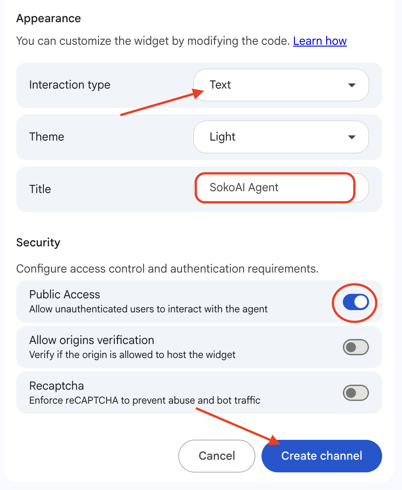

# Phase 3: Deploying the Agent

In this phase, you will publish the SokoAI agent and embed it into the SokoAI marketplace website using a web widget.

---

## Step 1: Open the Publish Panel

1. Navigate to the top of your Agent Builder page and click the **Publish** icon (highlighted in the top navigation bar).

    

2. This takes you to the deployment options page. Select **Create web widget**.

    

---

## Step 2: Configure the Web Widget

A configuration page opens. Complete the following settings:

1. **Widget name** — Enter `soko-deploy`.

2. **Deployment version** — Click the existing deployment version shown, or click **Create a new version** if none exists.

    

3. **Input method** — Switch the agent's input method to enable **Text input** (the default may be restricted).

4. **Agent title** — Enter the title that will appear in the chat widget when it is live on the website:

    ```
    SokoAI Agent
    ```

5. **Public access** — Enable public access.

6. **reCAPTCHA** — Enable reCAPTCHA to prevent bot traffic abuse.

7. Click **Create Channel** to complete web widget creation.

    

---

## Step 3: Copy the Deployment ID

1. After the channel is created, deployment instructions will be displayed.
2. Using the **copy icon**, copy the **Deployment ID**.

    !!! tip
        You will need this Deployment ID when redeploying the website. Add it as an environment variable in your hosting configuration.

---

## Step 4: Redeploy the Website

1. Add the copied Deployment ID as a new environment variable in your website's hosting configuration.
2. Redeploy the website.
3. Once deployed, the **SokoAI Agent** chat widget will appear in the **bottom right corner** of the website.

---

!!! success "Phase 3 Complete"
    The SokoAI agent is now live and embedded in the website. Proceed to testing to verify the full conversation flow.

---

<div class="page-nav">
  <div class="nav-item">
    <a href="../sokoai-agent-instructions/" class="btn-secondary">← Previous: Agent Instructions</a>
  </div>
  <div class="nav-item">
    <span><strong>Section 30</strong> - SokoAI: Deployment</span>
  </div>
  <div class="nav-item">
    <a href="../sokoai-testing/" class="btn-primary">Next: Testing →</a>
  </div>
</div>
