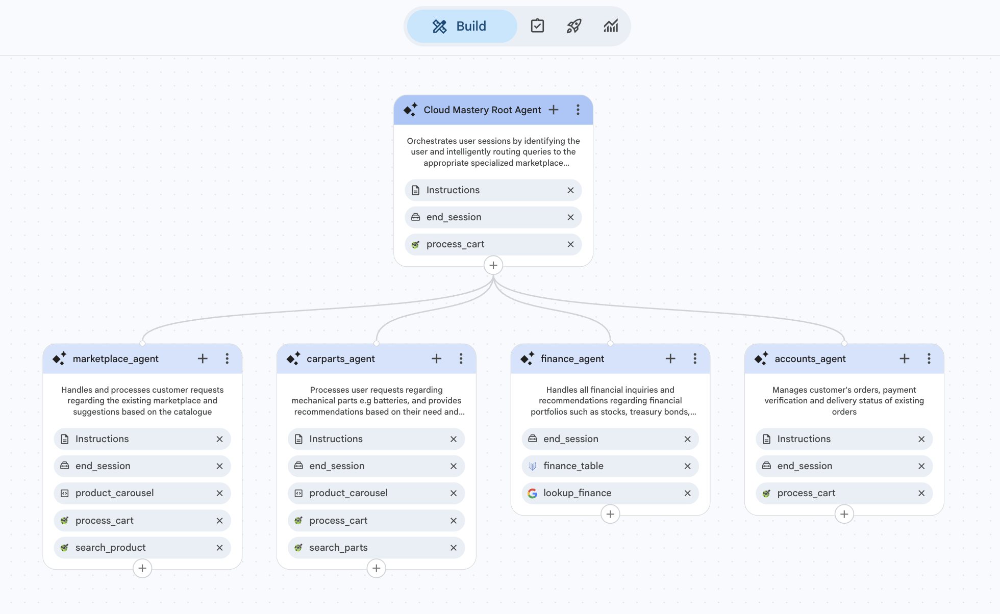

# Building a Multi-Agent System with SokoAI

In this lab, we build **SokoAI** — a production-ready, multi-playbook AI agent system powered by Vertex AI Agent Builder. SokoAI is a marketplace assistant that intelligently routes customer queries to specialist agents, each with a focused domain of responsibility.

This lab uses the modern **Playbook architecture**, replacing older flow-based logic. By the end, you will have a fully functional agent embedded in a live website.

---

## What You Will Build

SokoAI is made up of one **Root Agent** that orchestrates the conversation and four **Specialist Agents** that each handle a specific domain:

| Agent | Responsibility |
|---|---|
| **Soko AI Agent** (Root) | Identifies customers, routes queries to the correct specialist, and handles general support |
| **Marketplace Agent** | Browses and orders grocery and household products |
| **Carparts Agent** | Finds vehicle-specific parts and batteries |
| **Finance Agent** | Provides investment and financial market guidance |
| **Accounts Agent** | Handles order tracking, delivery status, and store policies |

---

## Architecture Overview

The agents work together through **silent handoffs** — the root agent never responds directly to product queries. Instead, it immediately transfers the user to the right specialist. Each specialist can also transfer back to the root agent for out-of-scope requests.

```
User
 │
 ▼
Soko AI Agent (Root)
 ├──► Marketplace Agent  (groceries + household)
 ├──► Carparts Agent     (vehicle parts + batteries)
 ├──► Finance Agent      (stocks, bonds, MMFs)
 └──► Accounts Agent     (orders + delivery + policies)
```



---

## Tools Used

The agents are powered by several backend tools:

| Tool | Type | Purpose |
|---|---|---|
| `process_cart` | OpenAPI (Cloud Run) | Cart management, checkout, order tracking |
| `search_parts` | OpenAPI (Cloud Run) | Search the vehicle parts catalogue |
| `search_products` | OpenAPI (Cloud Run) | Search the marketplace product catalogue |
| `finance_table` | BigQuery Datastore | Financial instruments data (stocks, bonds, MMFs) |
| `lookup_finance` | Google Search | Live Kenyan financial market information |
| `product_carousel` | Widget | Display product cards in the chat interface |

---

## Lab Steps

This lab is divided into the following steps:

1. **[Step 1: Initial Setup](sokoai-setup.md)** — Create the AI app in Vertex AI Agent Builder
2. **[Step 2: Building Playbooks](sokoai-playbooks.md)** — Configure the root and specialist agents
3. **[Step 3: Setting Up Tools](sokoai-tools.md)** — Create all tools
4. **[Step 4: Agent Instructions](sokoai-agent-instructions.md)** — Connect tools to agents and add XML instructions
5. **[Step 5: Deployment](sokoai-deployment.md)** — Publish the agent to the SokoAI website
6. **[Step 6: Testing](sokoai-testing.md)** — Verify the full workflow

---

!!! tip "Prerequisites"
    Before starting this lab, ensure you have:

    - Access to the [CX Agent Studio console](https://ces.cloud.google.com) using your training GCP account from Session 1
    - Your assigned GCP project ID

---

<div class="page-nav">
  <div class="nav-item">
    <a href="../data-pipeline-visualize-looker/" class="btn-secondary">← Previous: Visualize Data</a>
  </div>
  <div class="nav-item">
    <span><strong>Section 25</strong> - SokoAI: Multi-Agent Lab Overview</span>
  </div>
  <div class="nav-item">
    <a href="../sokoai-setup/" class="btn-primary">Next: Initial Setup →</a>
  </div>
</div>
