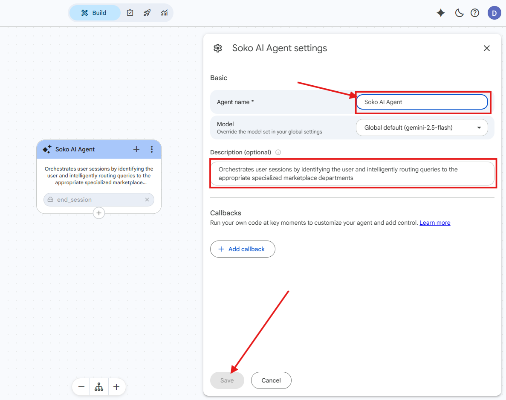
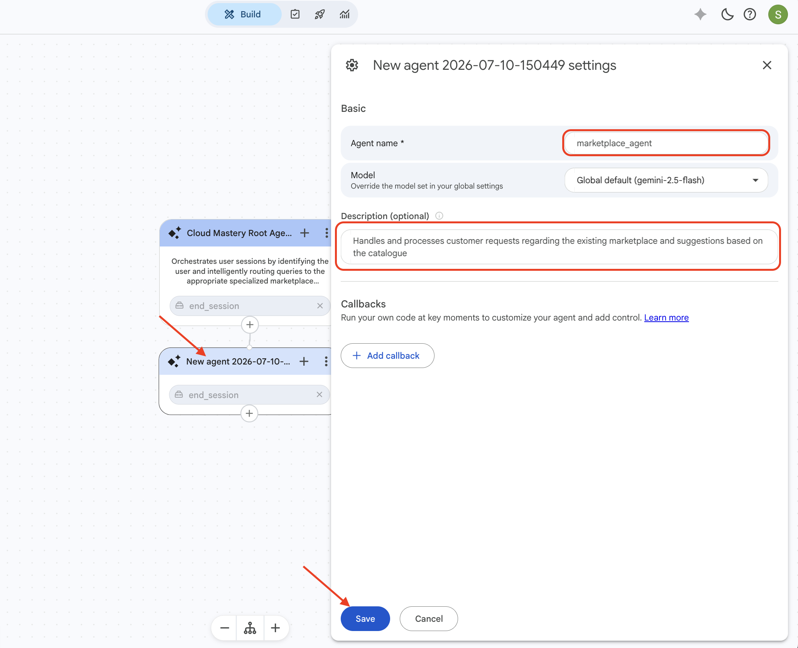
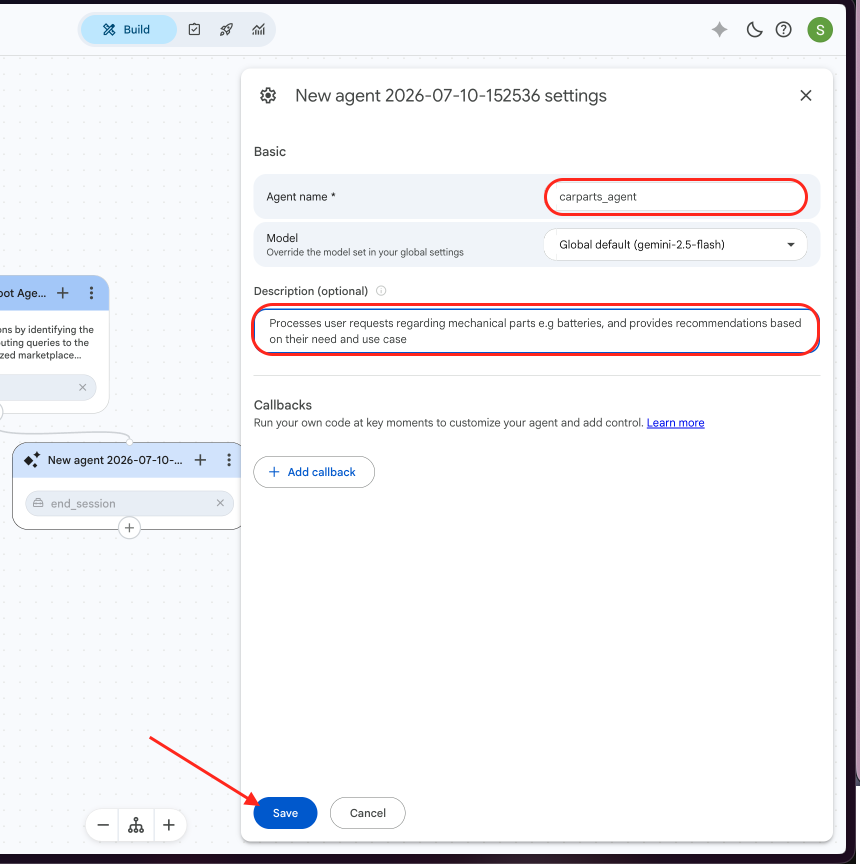
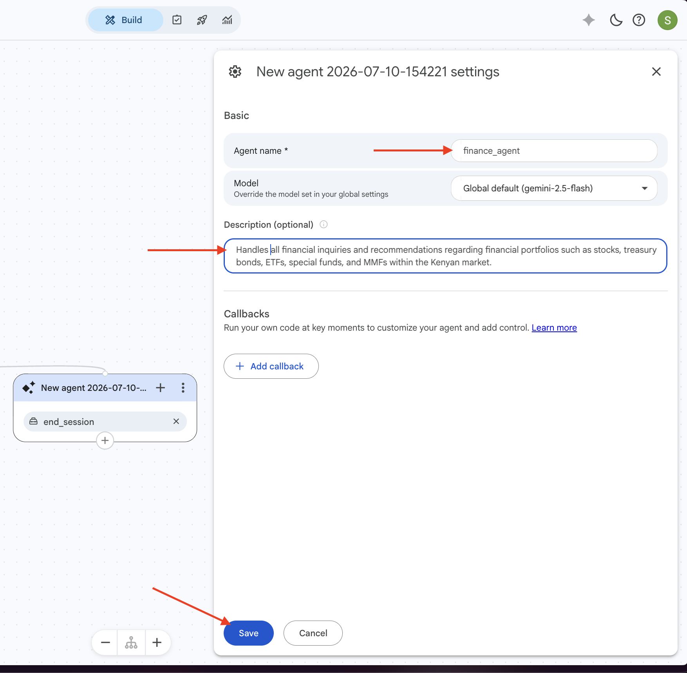
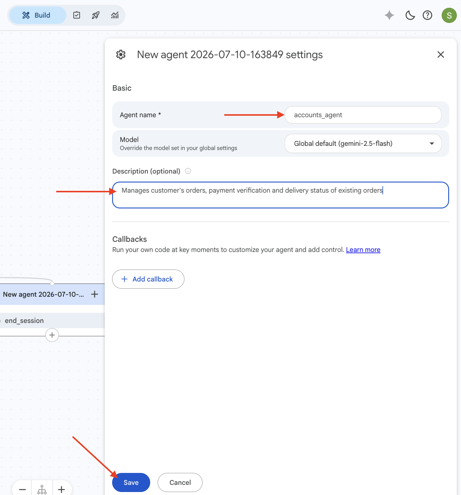
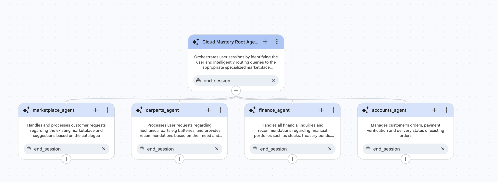

# Step 2: Building Playbooks

In this step, you will configure the **Root Agent** and create four **Specialist Sub-Agents**. These playbooks define the agent hierarchy that powers SokoAI conversation routing.

---

## Part A: Configure the Root Playbook (Soko AI Agent)

The root agent is automatically created when you create your AI app. You will now configure it with a name and description.

1. On your Agent Builder page, click the **agent title** in the left panel. A configuration sidebar will open.

2. Set the agent name to `Soko AI Agent`.

3. In the **Description (optional)** field, paste the following:

    ```
    Orchestrates user sessions by identifying the user and intelligently routing queries to the appropriate specialized marketplace departments
    ```

4. Once you have confirmed the configuration is correct, click **Save*it*.

    

!!! success "Root agent configuration complete!"

---

## Part B: Create the Specialist Sub-Agents

You will now create four sub-agents. Each is an independent Playbook that the root agent can hand off to.

### Add a Sub-Agent

1. Click the **`+` sign** at the bottom of the root agent node, then select **Add new sub-agent**.

    <!-- ADD IMAGE: image10 - Add new sub-agent option -->

2. When the following pop-up appears, click **Create Anyway** to disable Gemini helpers and proceed.

    !!! note
        This action disables Gemini recommendations. Click **Create Anyway** to continue.

    <!-- ADD IMAGE: image11 - Create Anyway popup -->

---

### Sub-Agent 1: Marketplace Agent

1. Click the new agent's title to open the configuration sidebar.
2. Set the name to `marketplace_agent`.
3. Add the following description:

    ```
    Handles and processes customer requests regarding the existing marketplace and suggestions based on the catalogue
    ```

4. Click **Save** and close the sidebar.

    

---

### Sub-Agent 2: Carparts Agent

1. Repeat the steps above to add another sub-agent.
2. Set the name to `carparts_agent`.
3. Add the following description:

    ```
    Processes user requests regarding mechanical parts e.g batteries, and provides recommendations based on their need and use case
    ```

4. Click **Save**.

    

---

### Sub-Agent 3: Finance Agent

1. Add another sub-agent.
2. Set the name to `finance_agent`.
3. Add the following description:

    ```
    Handles all financial inquiries and recommendations regarding financial portfolios such as stocks, treasury bonds, ETFs, special funds, and MMFs within the Kenyan market.
    ```

4. Click **Save**.

    

---

### Sub-Agent 4: Accounts Agent

1. Add the final sub-agent.
2. Set the name to `accounts_agent`.
3. Add the following description:

    ```
    Manages customer's orders, payment verification and delivery status of existing orders
    ```

4. Click **Save**.

    

---

## Verify Your Setup

When all four sub-agents have been created, your Agent Builder page should look like this — with the root agent at the top and all four specialists branching below it:



!!! success "Step 2 Complete"
    All five playbooks are now configured. In the next step, you will create the tools that power these agents.

---

<div class="page-nav">
  <div class="nav-item">
    <a href="../sokoai-setup/" class="btn-secondary">← Previous: Initial Setup</a>
  </div>
  <div class="nav-item">
    <span><strong>SokoAI: Building Playbooks</strong></span>
  </div>
  <div class="nav-item">
    <a href="../sokoai-tools/" class="btn-primary">Next: Setting Up Tools →</a>
  </div>
</div>
