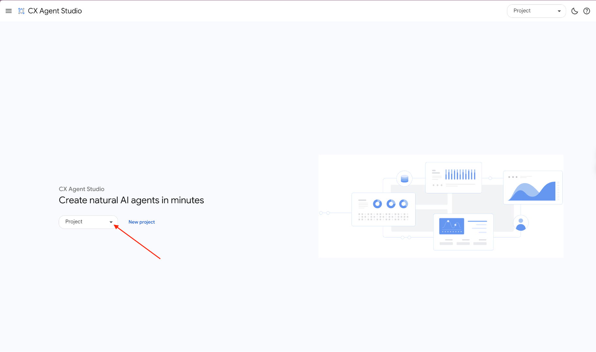
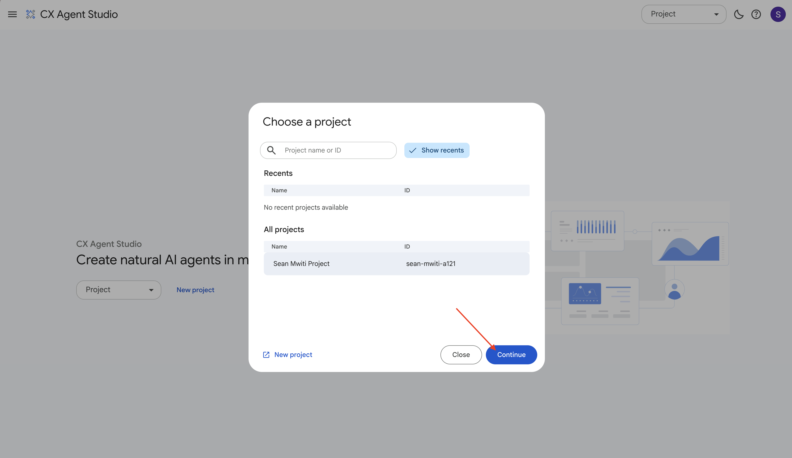
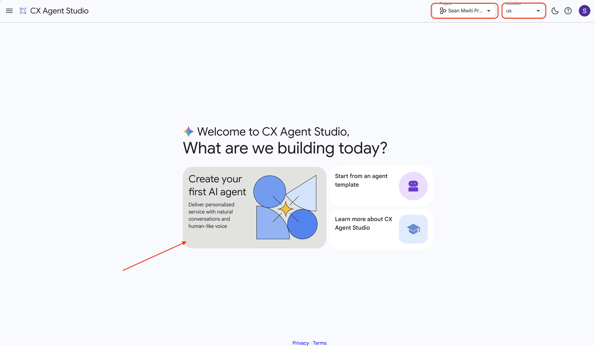
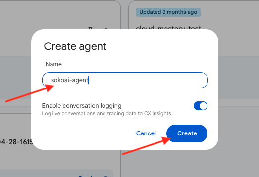
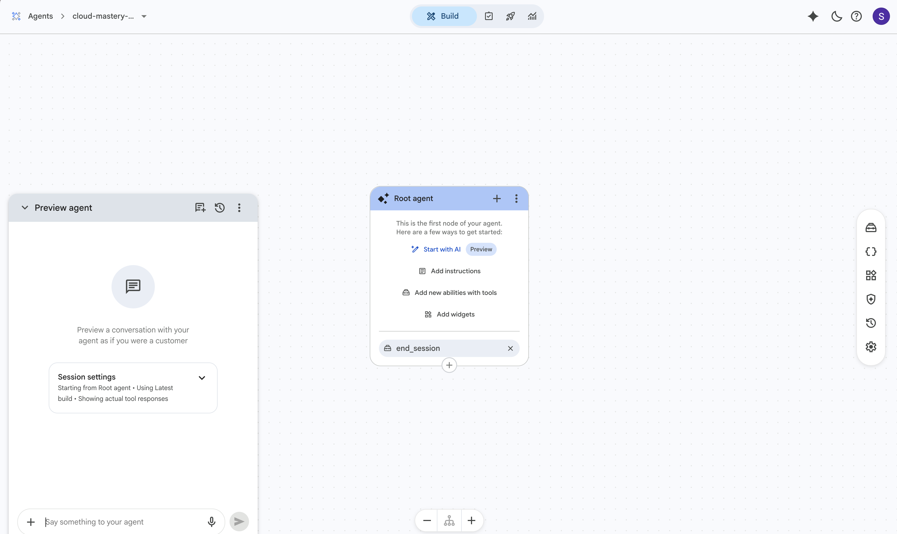

# Step 1: Initial Setup

In this step, you will log into the CX Agent Studio, select your project, and create the SokoAI agent application.

---

## Access Vertex AI Agent Builder

1. Log in to the [CX Agent Studio console](https://ces.cloud.google.com) using your training GCP account from Session 1.

2. You will see a page like this:

    

3. **Select your project.** Click the project dropdown at the top and select **View all projects**.

4. Find and select your assigned project (e.g. *sean mwiti*), then click **Continue**.

    

---

## Create the AI App

1. In the middle of the screen, locate the section titled **Create your first AI agent** and click on it.

    !!! note
        Ensure the region defaults to **US (Multiple regions)** before proceeding.

    

2. Enter a name for your agent — use `sokoai-agent` — then press **Create**.

    

3. Once the agent is created, click on it to select it.

4. This opens the **Agent Builder** page where you will configure all components.

    

---

!!! success "Step 1 Complete"
    Your SokoAI agent application is now created. In the next step, you will build the root playbook and the four specialist sub-agents.

---

  

    <a href="../sokoai-lab/" class="btn-secondary">← Previous: Lab Overview</a>
  

  

    <strong>Section 26</strong> - SokoAI: Initial Setup
  

  

    <a href="../sokoai-playbooks/" class="btn-primary">Next: Building Playbooks →</a>
  

